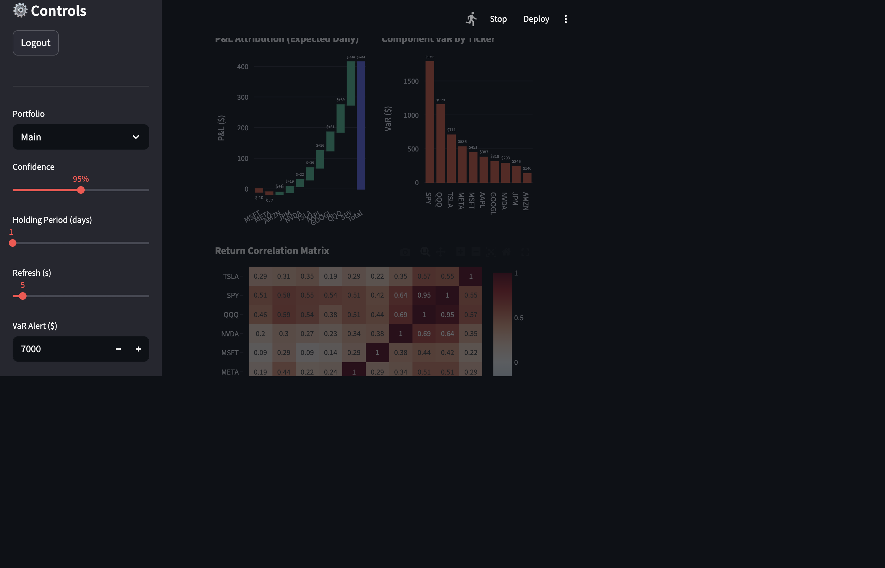

# Real-Time Portfolio Risk Dashboard



A live equity portfolio risk monitoring dashboard featuring Kafka price streaming, Monte Carlo Value-at-Risk, Black-Scholes Greeks, stress testing, Kupiec backtesting, and a Streamlit UI with authentication.

---

## Prerequisites

- Python 3.9+
- **Docker Desktop** — [Download here](https://www.docker.com/products/docker-desktop/)  
  Docker is required to run Kafka and Zookeeper. Install and start Docker Desktop before proceeding.

---

## Setup

### 1. Clone / enter the project folder
```bash
cd "Real-Time Portfolio Risk Dashboard"
```

### 2. Install Python dependencies
```bash
pip install -r requirements.txt
```

### 3. Configure environment
```bash
cp .env.example .env
# Edit .env and add your Alpaca paper trading API keys
```

### 4. Start Kafka (requires Docker)
```bash
docker compose up -d
```

---

## Running the Dashboard

Open **three separate terminals** from the project root.

**Terminal 1 — Price Feed**
```bash
export PYTHONPATH="$(pwd):$PYTHONPATH"
python feeds/price_producer.py
```

**Terminal 2 — Spark Stream (optional)**
```bash
export PYTHONPATH="$(pwd):$PYTHONPATH"
python streaming/stream_consumer.py
```

**Terminal 3 — Dashboard**
```bash
export PYTHONPATH="$(pwd):$PYTHONPATH"
python3 -m streamlit run dashboard/app.py --server.port 8502
```

Then open **http://localhost:8502** in your browser.

**Default login:** `admin` / `admin123`

---

## Shutdown

```bash
docker compose down
```

---

## Features

| Feature | Description |
|---|---|
| Live price feed | Kafka + Alpaca WebSocket with after-hours simulation fallback |
| Monte Carlo VaR | 10,000-path simulation, 95% confidence, scalable by holding period |
| CVaR / Expected Shortfall | Tail-risk beyond VaR |
| Beta & Sharpe ratio | Portfolio-level KPIs vs SPY benchmark |
| Component VaR | Per-ticker risk contribution |
| Stress scenarios | 8 macro shock scenarios (crash, rate spike, etc.) |
| Kupiec backtesting | Statistical VaR model validation (Proportion of Failures test) |
| Black-Scholes Greeks | Delta, Gamma, Vega, Theta from live option chains |
| Multi-portfolio comparison | Side-by-side NAV, VaR, Beta, Sharpe across portfolios |
| SQLite persistence | Price ticks and VaR snapshots stored across sessions |
| Auth gate | Login wall via streamlit-authenticator |

---

## Project Structure

```
.
├── config/
│   ├── settings.py          # Kafka, Alpaca keys, portfolio, risk params
│   └── auth.yaml            # Login credentials
├── feeds/
│   └── price_producer.py    # Kafka producer (live + simulated prices)
├── portfolio/
│   └── portfolio.py         # MTM valuation, account info, historical returns
├── risk/
│   ├── var_engine.py        # Monte Carlo VaR, CVaR, beta, Sharpe, component VaR
│   ├── backtesting.py       # Kupiec test
│   ├── greeks.py            # Black-Scholes Greeks + option chain
│   └── stress_scenarios.py  # Stress test P&L
├── db/
│   └── persistence.py       # SQLite price/VaR history
├── streaming/
│   └── stream_consumer.py   # Spark stream consumer (optional)
├── dashboard/
│   └── app.py               # Streamlit UI
├── assets/
│   └── dashboard_preview.png
├── docker-compose.yml
└── requirements.txt
```
